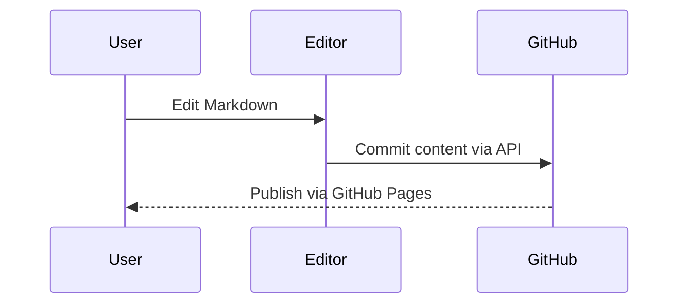

# Welcome to Wenku

This repository can be published on **GitHub Pages** and edited directly from the web editor.

## Features

- Multi-document management (`content/*.md`)
- GitHub API read/write commits
- Markdown preview with GFM and syntax highlight
- Mermaid diagram rendering
- Light / Dark theme

